# FRONT-END WEB DEVELOPMENT PROJECT
## State Information Website Demo

### Website Title:    Maryland
### Website Tagline:  Discover Maryland: Cities, Culture, and Community

### TECHNOLOGY USED
- HTML
- CSS
- JavaScript

### TOOLS USED
- VS Code
- Draw.io (wireframes)
 

# WEBSITE PREVIEW

## Homepage
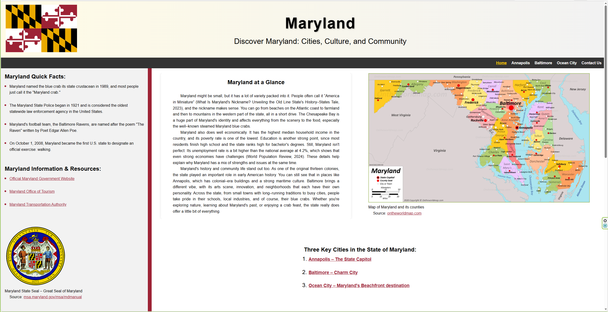

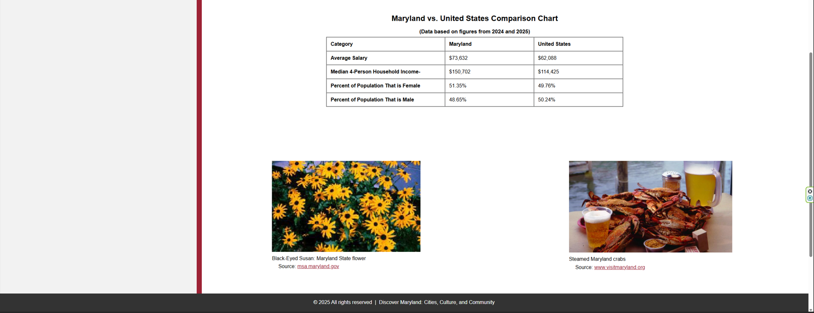

---

## Annapolis
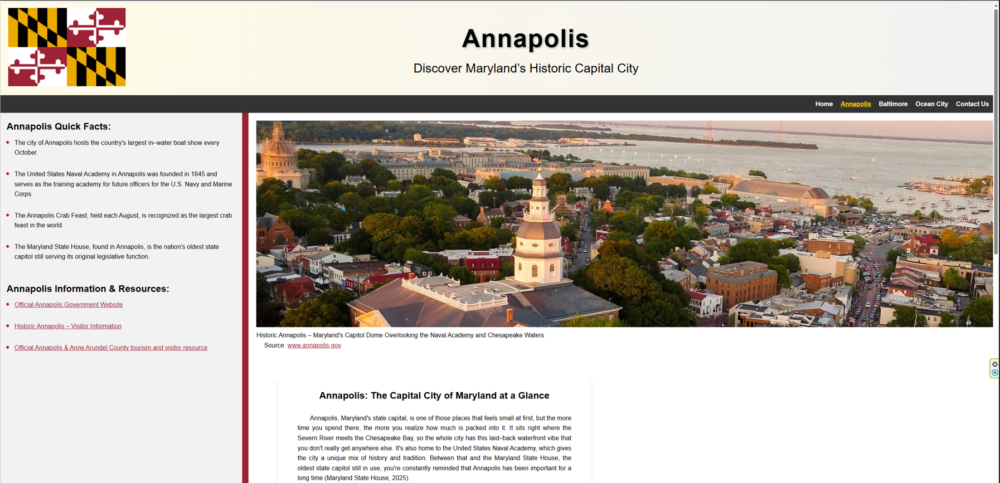

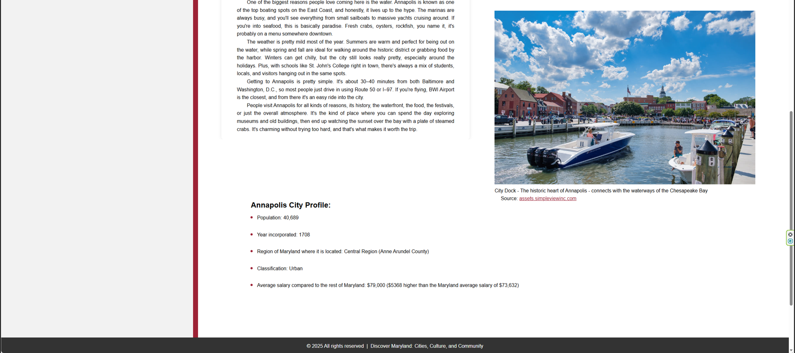

---

## Baltimore
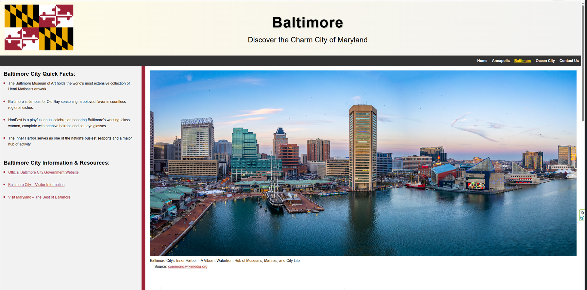

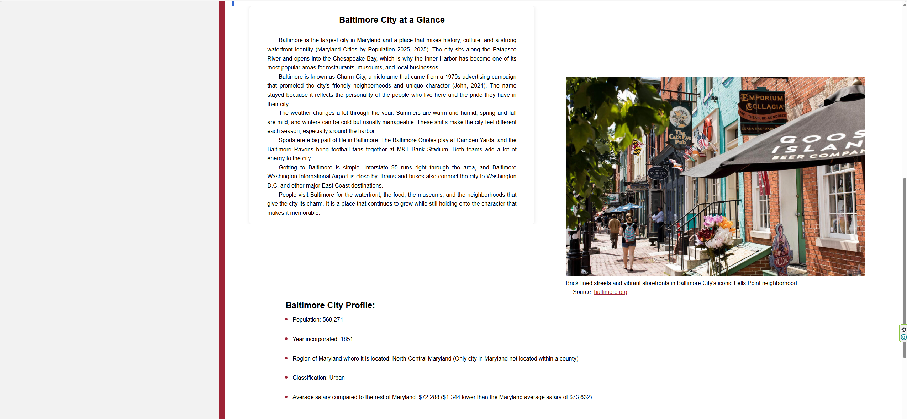

---

## Ocean City
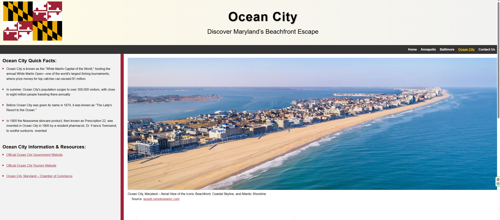

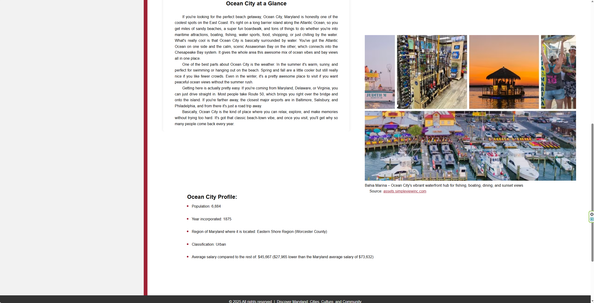

---
 
## Contact Us
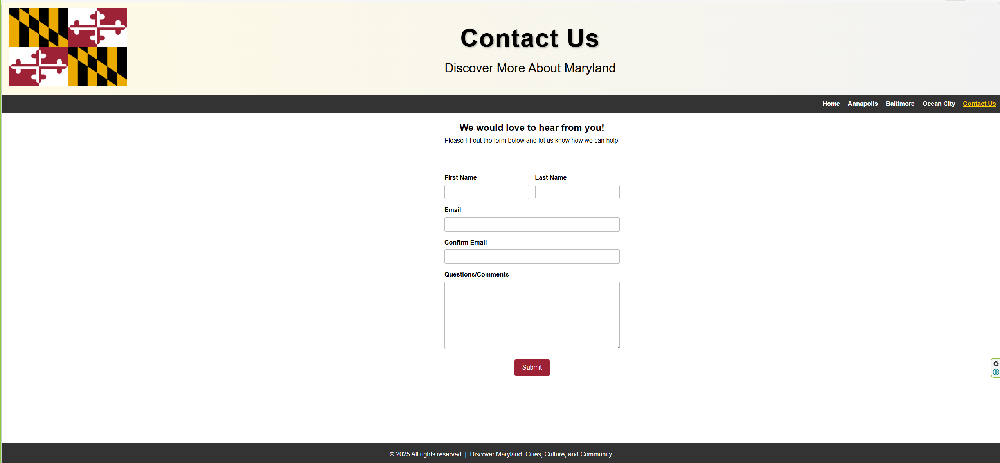

## Wireframes

### Homepage
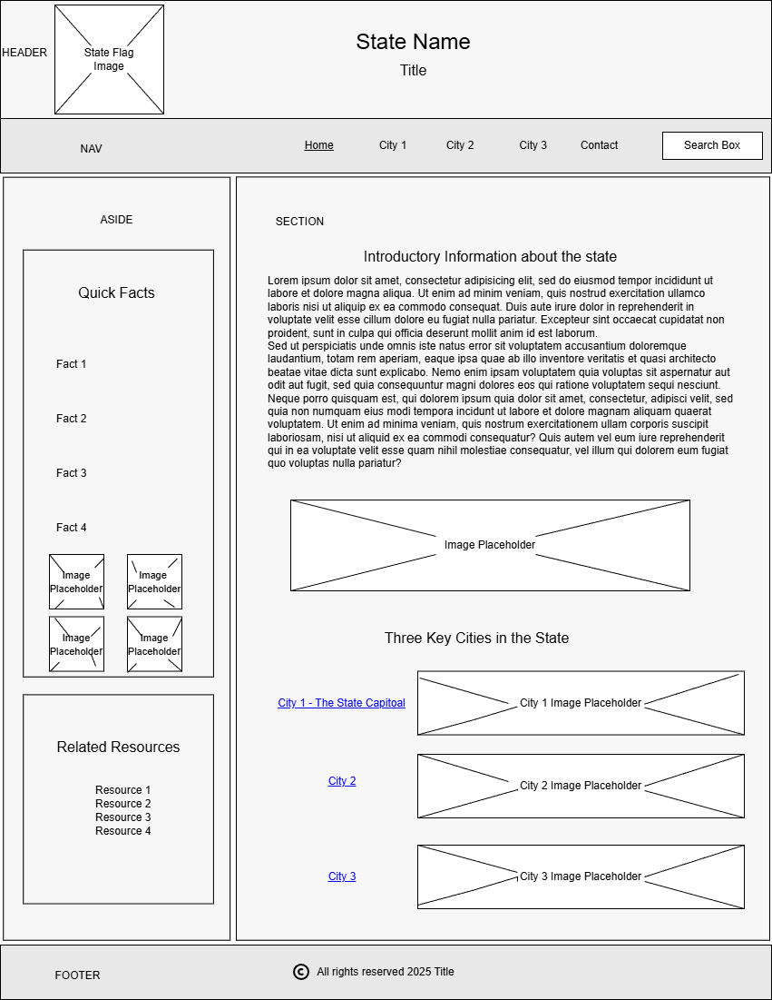

### All Other Webpages
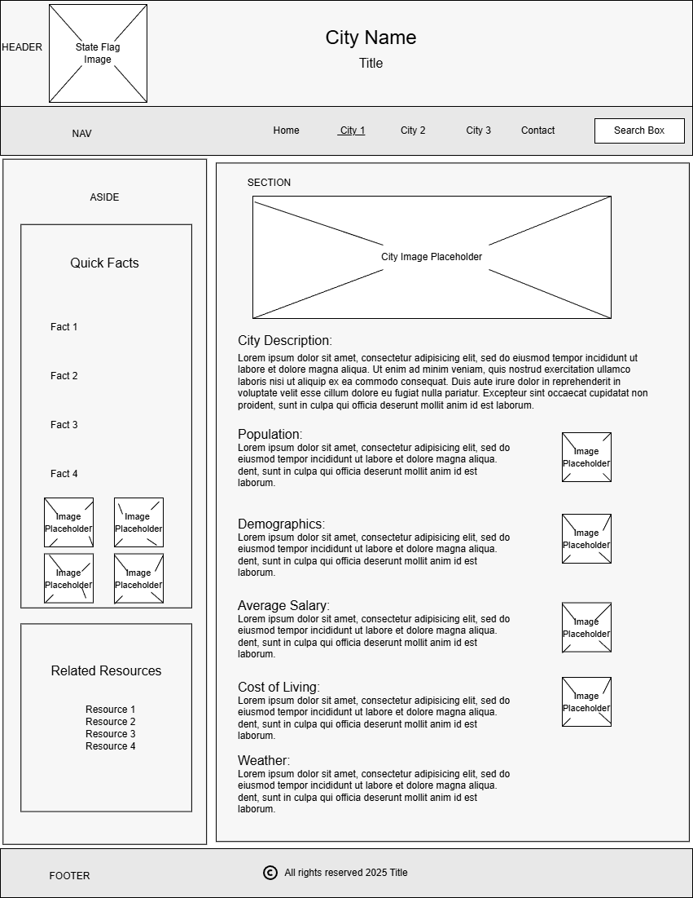

### SOURCES CITED

#### Global 

- Maryland Flag Image in Website Header: [Flagpedia.net](https://flagpedia.net/us-states/maryland/download/images)

#### Homepage

- Quick Facts about Maryland: [52 Interesting Facts About Maryland](https://thefactfile.org/maryland-facts/)

- Maryland state flower (Black-Eyed Susan) image: [msa.maryland.gov](https://msa.maryland.gov/msa/mdmanual/01glance/html/symbols/flower.html)

- Map of Maryland and its counties image: [ontheworldmap.com](https://ontheworldmap.com/usa/state/maryland/map-of-maryland.jpg)

- Steamed Maryland crabs image: [www.visitmaryland.org](https://www.visitmaryland.org/list/15-epic-ways-to-experience-authentic-maryland)

- Average U.S. Salary: [Fidelity – What is the average salary in the US?](https://www.fidelity.com/learning-center/smart-money/average-salary-in-us)

- Average Maryland Salary: [ZipRecruiter – What is the average salary in Maryland?](https://www.ziprecruiter.com/Salaries/--in-Maryland)

- Median Household Income by State 2024: [World Population Review](https://worldpopulationreview.com/state-rankings/median-household-income-by-state)

- Maryland Population by Gender: [Neilsberg – Maryland Population by Gender](https://www.neilsberg.com/insights/maryland-population-by-gender/#google_vignette)

- US Population by Gender: [The World Data – Population by Gender in US 2025 | Statistics & Facts](https://theworlddata.com/population-by-gender-in-us/)

- Average Maryland Salary: [SoFi Learn – Average US Salary by State](https://www.sofi.com/learn/content/average-salary-in-us/)

- States Tale. (2023, September 16). *What is Maryland’s nickname? Unveiling the Old Line State’s history*. *Wandering through the States*.
  [https://statestale.com/maryland/what-is-marylands-nickname/](https://statestale.com/maryland/what-is-marylands-nickname/)

- Maryland State Seal: [Maryland Government-MARYLAND MANUAL ON-LINE - State Symbols - Great Seal of Maryland](https://msa.maryland.gov/msa/mdmanual/01glance/html/symbols/reverse.html)

#### Annapolis webpage

- Official Annapolis Government Website: [annapolis.gov](https://www.annapolis.gov/)

- Historic Annapolis - Visitor Information: [Historic Annapolis](https://www.annapolis.org/visit/visitor-information/)

- Visit Annapolis and Anne Arundel County: [visitannapolis.org](https://www.visitannapolis.org/)

- Quick Facts about Annapolis: [FACTS.net](https://facts.net/world/cities/34-facts-about-annapolis/)

- Annapolis City Aerial View: [Annapolis.gov](https://www.annapolis.gov/)

- Annapolis Demographics: [www.annapolis.gov/875/Demographics](https://www.annapolis.gov/875/Demographics)

- Anne Arundel County Historical Chronology: [msa.maryland.gov/msa/mdmanual/36loc/an/chron/html/anchron.html](https://msa.maryland.gov/msa/mdmanual/36loc/an/chron/html/anchron.html)

- Annapolis, Maryland City Data: [www.city-data.com/city//Annapolis-Maryland.html#b](https://www.city-data.com/city//Annapolis-Maryland.html#b)

- Maryland State House. (2025). U-s-History.com: [www.u-s-history.com/pages/h2619.html](https://www.u-s-history.com/pages/h2619.html)

#### Baltimore webpage

- Fells Point, Baltimore City Image: [baltimore.org/neighborhoods/fells-point](https://baltimore.org/neighborhoods/fells-point)

- Baltimore City Quick Facts: [ohmyfacts.com/world/cities/50-facts-about-baltimore/](https://ohmyfacts.com/world/cities/50-facts-about-baltimore/)

- Baltimore City image by  
[Matthew Binebrink](https://commons.wikimedia.org/wiki/User:Mbinebri) — Own work, licensed under  
[CC BY-SA 4.0](https://creativecommons.org/licenses/by-sa/4.0).  
[View original](https://commons.wikimedia.org/w/index.php?curid=135141757)

- John, B. (2024, August 26). *What’s the secret behind Baltimore’s nickname?*  
*TouristSecrets.*  
<https://www.touristsecrets.com/destinations/whats-the-secret-behind-baltimores-nickname/?utm_source=copilot.com>

- Quick Facts about Baltimore: [facts.net/world/cities/36-facts-about-baltimore-md/](https://facts.net/world/cities/36-facts-about-baltimore-md/)

- U.S. Census Bureau Quick Facts for Baltimore City: [census.gov/quickfacts/fact/table/baltimorecitymaryland/PST045224](https://www.census.gov/quickfacts/fact/table/baltimorecitymaryland/PST045224)

- Maryland Department of Planning-Maryland Urban Areas: [planning.maryland.gov/MSDC/Documents/Census/Census2020/urban-rural/Maryland_urbanareas_population.pdf](https://planning.maryland.gov/MSDC/Documents/Census/Census2020/urban-rural/Maryland_urbanareas_population.pdf)

- Britannica-Baltimore City: [britannica.com/place/Baltimore](https://www.britannica.com/place/Baltimore)

- ZipRecruiter Baltimore City Salary Information: [www.ziprecruiter.com/Salaries/-in-Baltimore,MD](https://www.ziprecruiter.com/Salaries/-in-Baltimore,MD)

- Maryland Cities by Population 2025. (2025). Worldpopulationreview.com: [https://worldpopulationreview.com/us-cities/maryland](https://worldpopulationreview.com/us-cities/maryland)

#### Ocean City webpage

- Bahia Marina – Ocean City: [www.ococean.com/listing/bahia-marina/665](https://www.ococean.com/listing/bahia-marina/665/)

- Ocean City beach image:  
[www.ococean.com/things-to-do/beaches/](https://www.ococean.com/things-to-do/beaches/)
By Matthew Binebrink – Own work, CC BY-SA 4.0  
https://commons.wikimedia.org/w/index.php?curid=135141757

- Maryland Census (2020): [planning.maryland.gov/MSDC/Documents/Census/Census2020/urban-rural/Maryland_urbanareas_population.pdf](https://planning.maryland.gov/MSDC/Documents/Census/Census2020/urban-rural/Maryland_urbanareas_population.pdf)
 
- World Population Review – Maryland: [worldpopulationreview.com/us-cities/maryland/ocean-city](https://worldpopulationreview.com/us-cities/maryland/ocean-city)

- Founding of Ocean City, Maryland: [oceancitymd.gov/oc/150-years-of-smiles-ocean-city-rings-in-birthday-on-the-fourth-of-july](https://oceancitymd.gov/oc/150-years-of-smiles-ocean-city-rings-in-birthday-on-the-fourth-of-july/)

- Quick Facts – Ocean City: [www.oceancity.md/just-the-facts.html](https://www.oceancity.md/just-the-facts.html)

- 7 Things You Did Not Know About Ocean City: [www.ococean.com/blog/post/7-things-you-didnt-know-about-ocmd/](https://www.ococean.com/blog/post/7-things-you-didnt-know-about-ocmd/)

